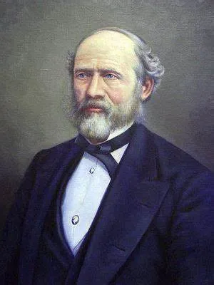
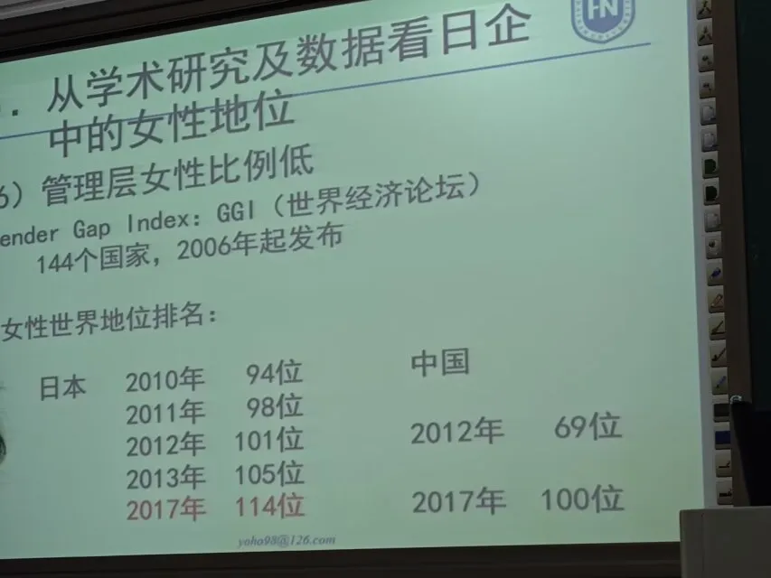

# 时话｜社會主義与女性主義

~~~~
作者 / 幸德秋水
排版 / 真知子
校对 / 真知子
编写 / 封酒编写组
发布 / 封酒
位于 / 2024-03-09 17:01 华北
~~~~

> 作者按：
> 
> 在中國，女性主义的问题仅仅在于，用后现代的表述去反抗前现代的存在。
> 

一个有趣的现象是，每当出现与“两性矛盾”或“男女不平等”有关的事件，在“馬克思主義者”和那些自谓“馬克思主義者”的人中间总会流出一些这样的声音：

- “不要挑动性别对立！”
- “男女矛盾本质是階級矛盾！”
- “要就事论事地看问题……”

不，在这里我们不去谈传统主义者、新儒学拥护者和新法西斯的观点，我们知道他们会做出怎样的反应：我们也明白他们在平权问题上一贯的反动立场。令人啼笑皆非的恰恰是上述犬儒主义语句出自“馬克思主義者”之口。

## 1. *馬克思主義的性别观点*

在两性关系和家庭问题上被大量引用的馬克思主義论著《家庭，私有制与国家的起源》中，恩格斯表达了如下观点：

> 进入階級社会以来，两性关系的历史就是父权制将女性置于丈夫绝对权力之下的历史。

> 这种单方面的专偶制家庭保留至今。

> 在階級社会中统治階級的婚姻也完全是一种階級地位决定的婚姻，它是最粗鄙的卖淫，女性不像在妓院那样按次收费，而是一次性出卖自己的肉体而已。

> 由于工业和贫困几乎抹杀了男女差异，女性的地位达到千年来顶点，因而这种不平等在无产者家庭中已然没有了基础（但他仍然存在，并在一段时间内苟延残喘下去）

> 真正的婚恋自由只有在资本主义消亡后才会出现，因为经济上的限制因素不复存在，只有爱意作为纽带。届时过去对专偶制进行补充的卖淫和婚姻的不可解除性也将不复存在。

***1877年，美国民族学和人类学家路易斯·亨·摩尔根的《古代社会》出版。恩格斯认为历史唯物主义对于摩尔根的研究具有指导意义，而其反过来也是科学证明。因此，恩格斯根据马克思的《路易斯·亨·摩尔根〈古代社会〉一书摘要》，结合他本人研究成果写下了该书。***

为什么不提对立？毫无疑问，恩格斯一针见血地指出了问题的根源和逻辑，也阐明了根本解决之道—— ***共产主义*** 。

于是这样的见解似乎变成了题中之义：

- “某某事件本质上是阶级矛盾，这背后体现了……”
- “生产关系是两性不平等的根本原因，要消灭……就必须……”
- “不要用性别矛盾掩盖问题本身……”

如果有人回忆一下开学典礼的校长训话，或者各国君主、总统和首相的新年贺词，那么对于“正确的废话”就应当有更直观的认识——何况这些话也不尽然正确。

不妨回顾这么一个有意思的故事，情节大概是这样的：

河流发大水，一个人的家被水淹了，他祈祷上帝救救他。

他的邻居划了艘船过来，叫他上船。他拒绝了，说：“上帝会来救我的！”

之后消防员来了。他也拒绝了帮助，说：“上帝马上就会来救我的！”

之后，他被淹死了。他来到天堂问上帝：你为什么不救我！上帝说：“我派了你的邻居和消防员，谁说我没有救你！”

***幽默***

社会主义者顾左右而言他，这是对于自己所“标榜”的身份的亵渎。女性问题不去直面，那么他所谓的“背后体现的阶级矛盾”又在哪里呢？明白宏观物理运动遵循热力学定律是正确的，但点一堆篝火却不能驱动蒸汽纺纱机。

这些冒牌社会主义者就是这样，所谓的社会主义只存在于他们的臆想中。 **真正的矛盾被他们视而不见，当作是“表象”。** 他们不能够反思自己身上遗留的反动性，我们应当为之感到悲哀。

不用多言，这种事实上的对立是存在的。

大而化之地重复“暴力事件又反映了……”不解决任何问题，何为“反映”？存在某个一定的现实处境，因而这个事件可被视为符号学意义上的一个映衬，这才称之为反映，而非事件爆发后才有对应的所谓现象。 **这种A本质上是B，B本质上是C的踢皮球学阀话术早就应当进入垃圾堆，他们只是在在复述历史的废墟而已。**

某个群体对某个群体的压迫？这才是现实处境。女性作为群体的现实处境一直都在，现象一直都在，社会氛围一直都在，处境一直都在那里。

**在这里我倒很想请问一下这些“馬克思主義者”，作为男性，他们是否能体会到女性长时间以来的心理感受？** 如果是“他们”代替女性作为高中生在公共交通工具这一密闭空间中面临猥亵的切切实实威胁之时，他们要不要和对方大谈“性犯罪问题的本质”呢？

## 2. *女性主义的补充观点*

有一点需要澄清的是，科学社会主义问世以来的理论虽然指明了妇女解放的道路，并论证了女性争取平权的必要性，但却存在一个广泛的误读：革命胜利后性别不平等消失的“客观可能性”并不意味着“机械的必然性”。 **矛盾绝不可能随着革命胜利自行消失。** 混淆必要条件与充分条件的结果就是前文所述，并导向“只要……就……”的因果论（这一点在法律至上的观点中最为明显，认为依靠完整贯彻法律就可以解决一切问题的拜物教在中国城市中产阶级特别是知识分子中是很受欢迎的，其本质是对强力机关的崇拜）。

不能不承认，既有的社会主义理论和实践对于女性而言是排他的。要突破从前时代的局限性，就要意识到这一点。

马克思主义发端于十九世纪上半叶，彼时女性的完整人权还在晨光熹微的起步阶段，在世界绝大多数地方，女人根本没有作为“人”的权利。因而最初的马克思主义论述对于妇女解放只描绘了大致的轮廓与原理。随着社会主义实践的发展，在苏联、新中国和各新民主主义国家都进行了大规模的妇女解放运动，**各国女性参与到各领域建设和社会主义革命中去，贡献了自己的力量**。然而不可否认的是，这些实践本身更多带有“给予”性质，并且即便在革命后，**各社会主义政权也没有能够解决女性占弱势地位的根本问题**。

***苏联纪念妇女节海报，上面绘有多位女性职工的肖像。***

科学社会主义作为脱胎于古典哲学的理论，其思路必然带有线性逻辑的痕迹：以无产阶级解放作为最高任务，以此从一个小节过渡到下一个小节。因此产生这样一种误解，好像将性别问题提到主要高度来就会分散对无产阶级解放这一“主线任务”的关注，从而白白耗费精力。但持这种观点的人忘记了，**如果不从现状着手，最高任务也无从实现**。

伟大的女权运动家和女性主义理论家波伏瓦认识到，数千年的父权社会对于女性存在盘根错节、根深蒂固的刻板影响、歧视和各种暴力。**消灭不平等的经济基础仅仅是个开始，真正难以去除的偏见根植于头脑之中，为意识形态国家机器日日夜夜所鼓吹的女性从属地位在一代代人（不论男女）的脑海中生根发芽**：这个社会说到底是为了男人设计的，女性在政治、经济、文化、思想、认知、观念、伦理等所有领域都处于尴尬的“例外”或者边缘地位——从语言的构成甚至都能反映这一点——这种“第二性”的意识存在于生活的任何一个角落，而要去除它们，就必须彻彻底底地清算旧意识。

***父权制是先于资本主义而存在的，因此推翻资本主义只是结束男性对女性压迫的必要条件，而不是充分条件。***

**如果没有承认这一点的勇气，那更遑论完成什么社会主义革命了。**

***1982年苏联庆祝国际妇女节的女性主义海报。***

## 3. *问题*

今天的简体中文互联网究其本质是一个城市中等收入群体的民意反应平台，而这个平台处于一种“受控制”的状态下，表现出很多“不自然”的氛围。

***对“田园女权”和“拳师”的指控甚至一度令人谈女权色变，转而说“我支持平权”；似乎女权运动开原始母系氏族的倒车。***

举例而言，在两边不同长短的杠杆两端，如果放置同重的物体，结果仍然是不平衡。换言之，**五千年强烈的压迫不得不导致扭曲的爆发**——尽管这种爆发大多数情况下都是孤立而徒劳的，**但绝对不可以说它们是没有道理的**。

这种扭曲在我们立足的土地上达到了这样的程度：一头是第二轮女权运动阐发的马克思主义女性主义和存在主义女性主义在现代性基础上提出**彻底平权**的问题，另一头却是高级学者和政界人物在大众媒体赤裸裸地以生育指标和“传统道德”将女性继续物化为劳动力再生产（从而实现那什么什么的什么复兴）的工具和维系家庭作为统治秩序最小单元的“**贤妻良母**”。

话到此处，才真正回到了那个核心问题—— ***晚期资本主义本身的溃烂和封建前现代意识形态的残余与异变交错地存在于这片同时拥有最大现代都市和最贫困高原农村的土地上，这片自己既是帝国主义也是殖民地的土地上*** 。要解决他们，就必须将整个资本主义秩序连根拔起。也只有在各个领域都向资本主义（无论是其意识形态还是社会存在本身）开战的情况下，这个目标才能实现。

因此，不要害怕被指控为“拳师”，也不要回避“性别对立”（按照马克思主义基本原理，两性的对立与统一必然同时存在），直面糟糕透顶的女性群体现状，以共产主义终极目标——人类解放——为主轴一步一步做出改变，如此，才配得上一个“**馬克思主義者**”的自谓。

“宁可一思进，莫在一思停。”

## SP. *后记：写在中国第一百个妇女节*

每每谈及女性就业情况和心理疾病率等问题时，不管哪位老师往往只能进行**东亚三兄弟的大比烂**。这倒并不是因为专业方向或生活视野的局限，**在“为什么不对比西方的数据”的背后，是“我们共同的窘境”这一事实**。适逢友人写道，对于“共产共妻”这一早期反 Comme 口号的恐惧与迷恋的矛盾感情根植于刻骨的“缺失”。如果暂且借用这一概念，在整个东亚的女性处境中，同样的缺失笼罩着我们。

被丈夫以辞职顾家作为结婚条件的日本家庭主妇和因为面试时因为有计划生子而被拒绝的中国毕业生面对的暴力来自不同方向，设置倍于男性的女子录取分数线的东京各高校和将拐卖来的妇女进行人身囚禁的中国村落所施加的暴力也出于完全不同的原因。但不论面对传统父权家庭秩序的退让，或是在效率至上主义的现代化生产秩序时沦为“不经济”的一个数据，都处处显示面对着系统性不平等女性依旧缺乏对策。

我们的缺失在于，**大众意识形态对此选择搁置**。在被 communist 和高强度阶级战争整整翻耕洗礼了三十年的中国，男性们会心安理得地说：“**如今已经是新社会了，早就男女平等了。**”并不无鄙视地提起邻居未被暴力革命涤荡的儒教作风。而日本年轻社员则一面不屑地认为办公室里心眼甚小，只对家长里短感兴趣，故而只能端茶送水的女同事是活该如此，一面列举着优秀女性当上高管的经历论证战后的改造和资本主义现代化冲刷已经“**彻底改变了日本**”。

所以不难理解一口咬定“平权”并籍此“反对女权”的奇异搞笑发言在中文互联网已经是司空见惯之事。 **正因自己从未想象过异性在社会意义上的平等权利，实践的缺失导致他们疯狂地捍卫自己对异性那并不存在的“传统优势”，并对一切试图侵犯这假想优势的对象报以敌意。** 正因为明知这种平等尚未完成，才大摇大摆地满足于谈论平等以为捍卫自身残存尊严的武器。

在全球资本主义市场中的东亚，革命退潮后的野蛮积累和儒教主义回潮同资本主义增长奇迹受顿挫的衰落危机一样，都是孕育新保守主义的最好培养基。而这种新反动不一定会比历史上更加凶狠，却一定**更加虚伪、阴险和畸形**。

